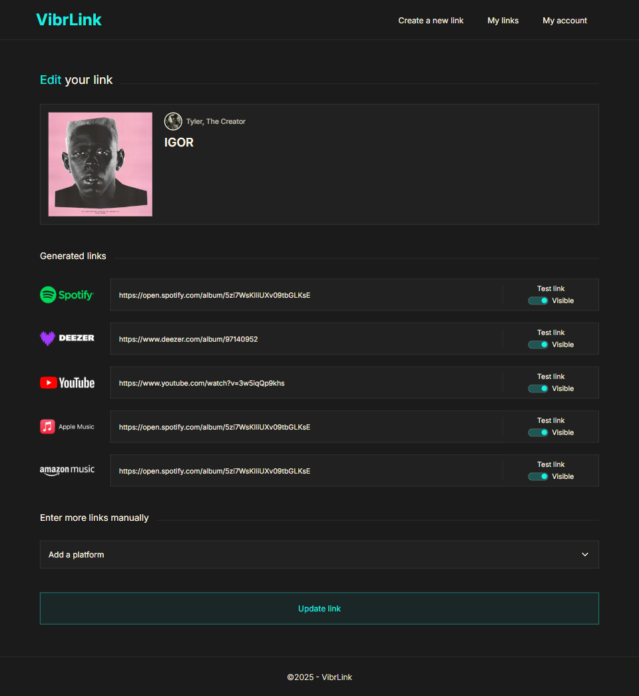

# VibrLink

#### _- Partie frontend -_

#### Application de génération de fanlinks pour promotion musicale

# • • •

## Description

Cette application permet à un utilisateur ...

## Fonctionnalités

- **xxxx** : xxxx

## Technologies utilisées

- **xxxx** : xxxx

## Configuration

### Communication avec le backend

La partie frontend détaillée ici communique avec un backend présent sur un autre dépôt (<a href="">dépôt du backend</a>). Pour lier le backend au frontend:

1. Créez un fichier `.env` à la racine du projet et l'URL du backend comme suit :
   ```plaintext
   NEXT_PUBLIC_BACKEND_URL=BackendUrl
   ```
2. Assurez-vous que votre fichier `.env` est ignoré par Git. Le fichier .gitignore doit inclure .env pour éviter que la clé ne soit exposée publiquement.

## Installation

1. Clonez le dépôt:
   ```plaintext
   git clone url depot
   ```
2. Accédez au projet:
   ```plaintext
   cd nom projet
   ```
3. Installez les dépendances:
   ```plaintext
   npm install
   ```
4. Lancez le serveur de développement:
   ```plaintext
   npm run dev
   ```
5. Ouvrez votre navigateur et accédez à http://localhost:3000 pour voir l'application en action.

## Tests

Des tests unitaires ont été écrits pour assurer le bon fonctionnement des fonctionnalités critiques de l’application. Pour les exécuter, utilisez la commande suivante:

```bash
# unit tests
npm run test

# test coverage
npm run test:cov
```

## Screenshots

1. Interface: Présentation de l'app.


2. Interface: Accueil du dashboard invitant à la création du compte.


3. Interface: Point d'entrée "Créer un nouveau fanlink".


4. Interface: Liste des fanlinks créés.


5. Interface: Edition d'un fanlink (modifier url, supprimer plateforme, rendre visible ou invisible une plateforme).



6. Interface: Exemple de la page publique à partager (version desktop).


## Note

Ce dépôt ne concerne que la partie frontend de l'application. Pour fonctionner celle-ci est indissociable de son backend réalisé en NodeJs.

**Bonne découverte !**

FX.
